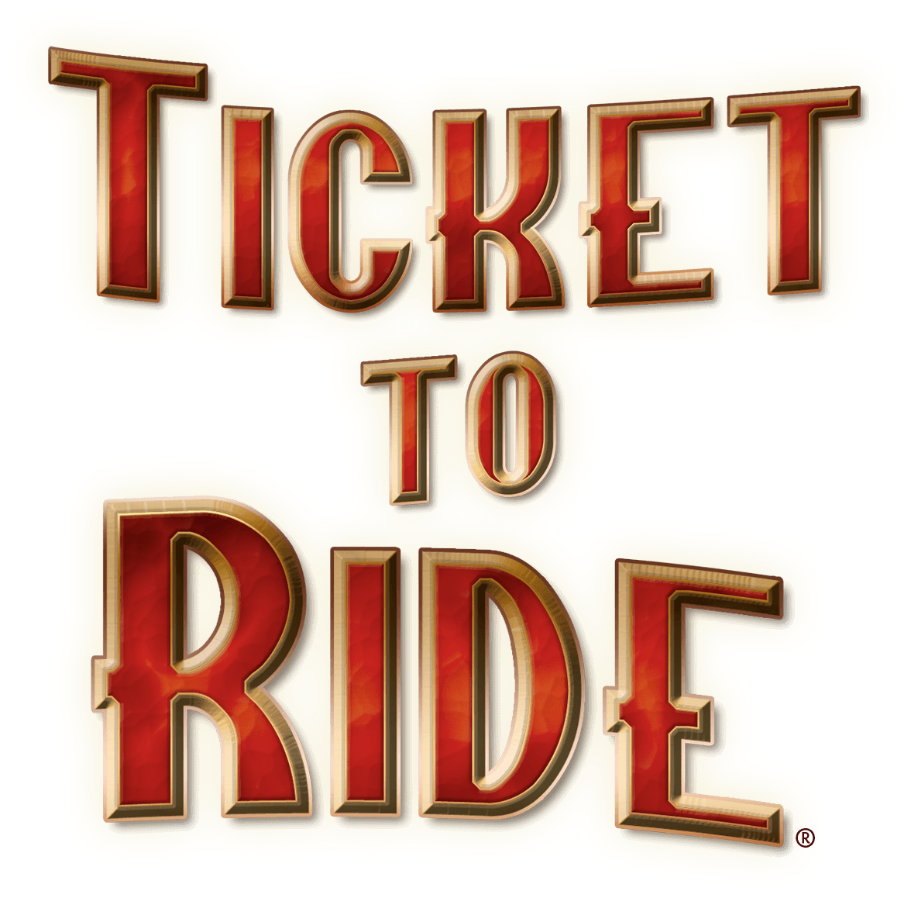

# Ticket To Ride

**Número da Lista**: 2 
**Conteúdo da Disciplina**: Grafos2 

## Alunos
|Matrícula | Aluno |
| -- | -- |
| 17/0080102  |  Lucas Gomes Lopes |
| 19/0106565  |  Fernando Miranda Calil |

## Sobre 
Baseado no jogo de tabuleiro Ticket To Ride, este projeto visa encontrar o menor caminho entre duas estações de trem utilizando o Algoritmo de Dijkstra. É também possível selecionar qual mapa você deseja realizar a busca.

## Screenshots

## Instalação 
**Linguagem**: Javascript 
**Framework**: ReactJS 
Descreva os pré-requisitos para rodar o seu projeto e os comandos necessários.

## Uso 
Explique como usar seu projeto caso haja algum passo a passo após o comando de execução.

## Outros 
Quaisquer outras informações sobre seu projeto podem ser descritas abaixo.

