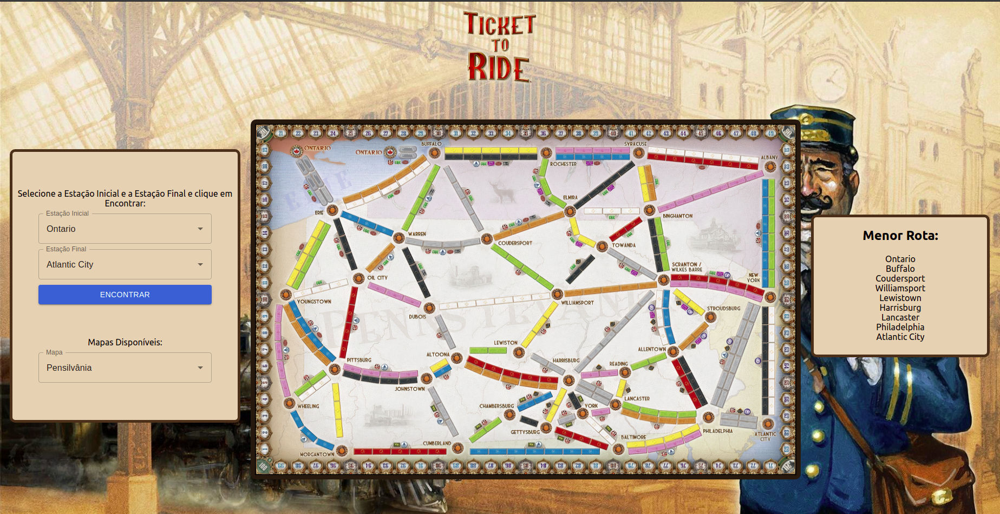

# Ticket To Ride


**Número da Lista**: 2<br>
**Conteúdo da Disciplina**: Grafos2<br>

## Alunos
|Matrícula | Aluno |
| -- | -- |
| 17/0080102  |  Lucas Gomes Lopes |
| 19/0106565  |  Fernando Miranda Calil |

## Sobre 
Baseado no jogo de tabuleiro Ticket To Ride, este projeto visa encontrar o menor caminho entre duas estações de trem utilizando o Algoritmo de Dijkstra. É também possível selecionar qual mapa você deseja realizar a busca.

## Screenshots





## Instalação 
**Linguagem**: Javascript<br>
**Framework**: ReactJS<br>

Siga as instruções a seguir :

1) Clonar o repositório:

```sh 
git clone git@github.com:projeto-de-algoritmos/Grafos2_TicketToRide.git
```

2) Acessar a pasta da aplicação React:

```sh 
cd Grafos2_TicketToRide
```

3) Instalar as dependências:

```sh 
npm install
```

4) Execute a aplicação:

```sh 
npm start
```
## Uso 
Selecione uma Estação Inicial e uma Estação Final e clique em "Encontrar" para que a menor rota seja calculada.

## Outros 
Quaisquer outras informações sobre seu projeto podem ser descritas abaixo.


